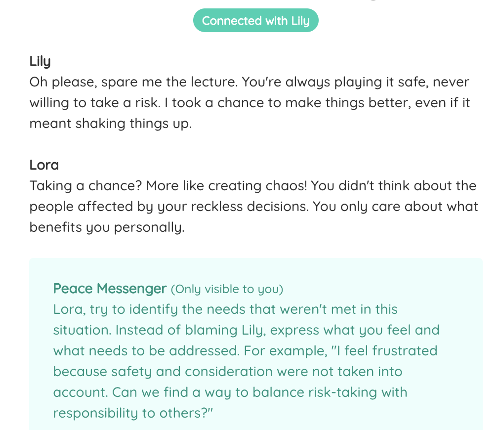

Peace Messenger serves as your guiding light, assisting you with AI in expressing your heartfelt emotions and needs to those who are dear to you. This project is an attempt to see if AI can make conversations better and help people understand and respect each other more. It utilizes WebRTC for peer to peer communication.

[Peace Messenger Demo](https://meetfebin.com/apps/peace)

Feel free to connect with me on [LinkedIn](https://www.linkedin.com/in/febinjohnjames/) or [Twitter](https://twitter.com/heyfebin).